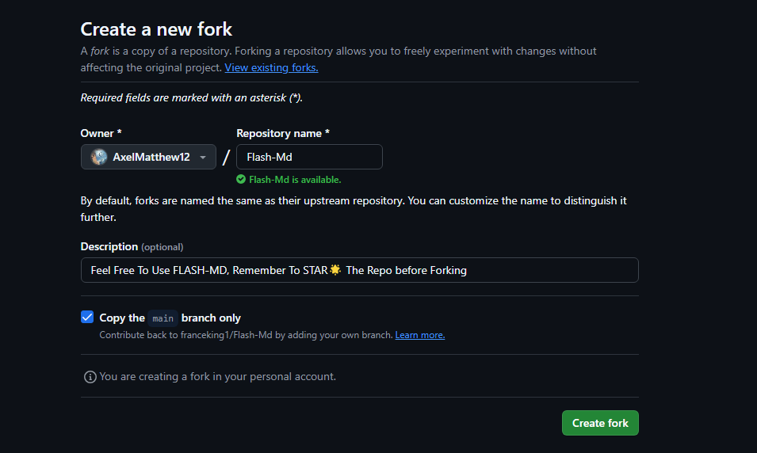
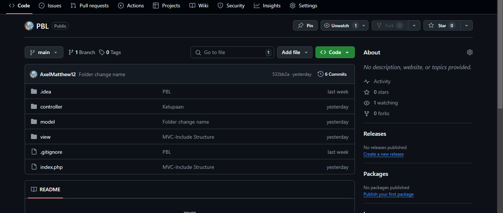
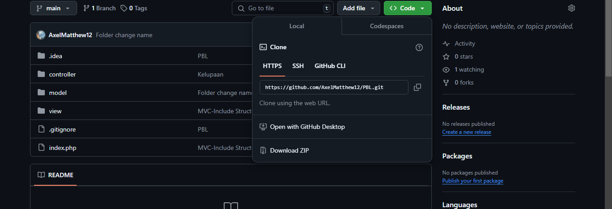
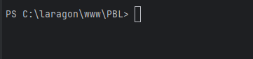
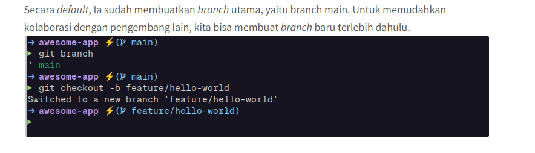
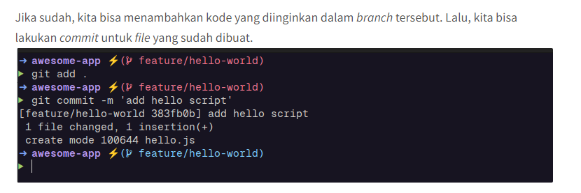

**Cara Fork , clone Repo dan Kolaborasi Di github**

*-FORK TUTORIAL-*

*Pertama kita cari fork menu di dalam repositori ini*

1. *Di sudut kanan atas halaman, klik Garpu (Fork).*
   
2. *Maka akan ada tampilan ini. **(Ini adalah contoh saja gambarnya hirakukan)***

3. *Lalu tekan untuk **Create Fork** untuk memasukan repo ke github kita nantinya*

*- CLONE REPO KE LOCAL TUTORIAL -*

1. *Salin *link HTTPS* yang nantinya akan kita clone dengan cara yang sama seperti yang pernah kita ketahui di semester 
sebelumnya*

***(Catatan) Sebelum clone jangan lupa Directory nya di dalam Laragon seperti ini***

*Memastikan Direktori di tempat yang tepat*

**Lalu kalian bisa melakukan step seperti biasanya yakni clone dengan git bash atau pun dengan Terminal vscode**

*- COLABORASI DI GITHUB -*

